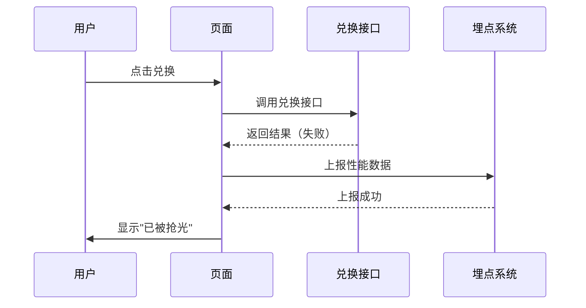

# 性能埋点系统分析

阿里系前端性能监控埋点系统完整解析

## 📋 概述

阿里系有两套监控系统：

### 1. **JS Tracker** - 性能监控

| 项目 | 内容 |
|------|------|
| **接口名称** | JS Tracker 性能埋点 |
| **接口地址** | `https://gm.mmstat.com/jstracker.3` |
| **请求方式** | GET |
| **触发时机** | 每次 API 调用后自动上报 |
| **作用** | 性能监控、失败追踪、用户行为分析 |

### 2. **ARMS** - 应用实时监控 (NEW!)

| 项目 | 内容 |
|------|------|
| **接口名称** | ARMS (Application Real-time Monitoring Service) |
| **接口地址** | `https://gm.mmstat.com/arms.1.1` |
| **请求方式** | POST |
| **Content-Type** | `text/plain;charset=UTF-8` |
| **触发时机** | 每次 API 调用后自动上报 |
| **作用** | 实时应用监控、详细性能分析、用户行为追踪 |

**对比：**
- **jstracker.3**: 轻量级性能监控（GET 请求）
- **arms.1.1**: 完整应用监控（POST 请求，数据更详细）

---

## 🔍 真实抓包数据

### 案例1: JS Tracker（500元红包失败）

```bash
curl "https://gm.mmstat.com/jstracker.3?url=mtop.fisson.gift.share.vcoin.exchange%2F1.0&screen=1707x960&sampling=1&version=rx-tracker%2F3.0.7&native=0&isInWindmill=0&success=false&params=%7B%22asac%22%3A%222A21B24LA1SI0HB0EEVN03%22%2C%22benefitCode%22%3A%222713305bd3794de5aede654a29a095c5%22%2C%22type%22%3A%22redPacket%22%2C%22ua%22%3A%22140%23L7sotPIIzzWhbzo2%2BbJ%2BK3N8s9zojbKPIyABZ8qrTYnTlfECCZa3lMBlRpxB4ylUKz74lp1zzXgG5pITJFzxixHmO6h%2Fzzrb22U3l61DHJ%2FVEThBUzrzKID%2BV3hqWb0eCjmijDapV3yqGDHT8yU%2FfoIbZycMl0x6XP0UDDCyxWqja5f0CQwaP4lOq19slJuyD%2FJGRvSak3rTFRMbCGoWHmzkHgeETTZyNXuDqTIP3fzawK3uXLz0%2BKoWsQIzn6RTtAN0Fs93GAsq6nMqznwBnZAVmG%2BnqGkMAlxroIexwXIiMezbC9cZag%2BoLF2rbMIgIklKvGI3MjSoJ%2B7T09Bx2TeYmU2Luty06Ojd5uuAIk3gxCcRwjyE8Fr5NQ2jRrwxxtQlGfF6dWzacMCB%2Fv%2BkhblgkYsCsExogtaGX29WgZCSucGDepKErgwDsM4hQrxVRLoqowWY7vqG%2FEnpfvvK9Q%2FfgPuPt3In6TktvjE6ubuBNrS3cWhNzb41IAb%2FOfxYwKVnrJg3DUxdRiMijLK7Ljgfug1PtnidKNdYlMXyySn2Rr4uC%2Bt5F3ynA7GD3b%2FaiSl9hF6SpMfcqf2QVggFDlFb5%2BFtAy9ygxec%2Bo0%2Btw4PXtA5GBTcmNSSZ5C40LPpRHxRyw2EUaBiqotCPGrYU5TrOI4APRA6XRqBJwHLgOrWD92kXdrwTc7%2BOymqBPqNHQVDxy3Js5z8ofO%2Fja85WH8SlA2qSn6LMorwfONpuc46UwJ6W3VD8NR2rSLxfnctUp7NOL%2FlQKyWXTcl5ivzXiPExY5awpUwU9xj9iFWh6cvBCGcxulkYyfwMsx3RnPNrz%3D%3D%22%2C%22umidToken%22%3A%22T2gAuQ-Cdb-peHmX-Jk81rNuxZqOGmxwYDjUUnNyRnaJl3vJjqF0uBd8cSCevwT3Luo%3D%22%7D&timing=485&st=17314&message=%7B%22api%22%3A%22mtop.fisson.gift.share.vcoin.exchange%22%2C%22data%22%3A%7B%7D%2C%22ret%22%3A%5B%22LATOUR_BENEFITE_SHOW_FAIL%3A%3A%E5%B7%B2%E8%A2%AB%E6%8A%A2%E5%85%89%22%5D%2C%22traceId%22%3A%222150494217630388717992738e1927%22%2C%22v%22%3A%221.0%22%2C%22retType%22%3A-1%7D&type=mtop_perf&apiType=1&apiTypeState=false&apiTypeMsg=&grey=" \
  -H "accept: image/avif,image/webp,image/apng,image/svg+xml,image/*,*/*;q=0.8" \
  -H "accept-language: zh-CN,zh;q=0.9" \
  -b "cna=OyRKHjK/czoCAZpA4ymqCmSo; cnaui=2214191126140; aui=2214191126140" \
  -H "user-agent: Mozilla/5.0 (Windows NT 10.0; Win64; x64) AppleWebKit/537.36 (KHTML, like Gecko) Chrome/142.0.0.0 Safari/537.36 Edg/142.0.0.0"
```

---

## 🔑 关键参数解析

### URL 参数（解码后）

#### 1. **url** - 目标 API
```
mtop.fisson.gift.share.vcoin.exchange/1.0
```
**说明：** 被监控的接口名称

---

#### 2. **success** - 成功状态
```
false
```
**说明：** 
- `true` - API 调用成功
- `false` - API 调用失败

---

#### 3. **params** - 请求参数（JSON）

```json
{
  "asac": "2A21B24LA1SI0HB0EEVN03",
  "benefitCode": "2713305bd3794de5aede654a29a095c5",
  "type": "redPacket",
  "ua": "140#L7sotPIIzzWhbzo2+bJ+K3N8s9zo...",
  "umidToken": "T2gAuQ-Cdb-peHmX-Jk81rNuxZqOGmxwYDjUUnNyRnaJl3vJjqF0uBd8cSCevwT3Luo="
}
```

**完整的 UA（解码后）：**
```
140#L7sotPIIzzWhbzo2+bJ+K3N8s9zojbKPIyABZ8qrTYnTlfECCZa3lMBlRpxB4ylUKz74lp1zzXgG5pITJFzxixHmO6h/zzrb22U3l61DHJ/VEThBUzrzKID+V3hqWb0eCjmijDapV3yqGDHT8yU/foIbZycMl0x6XP0UDDCyxWqja5f0CQwaP4lOq19slJuyD/JGRvSak3rTFRMbCGoWHmzkHgeETTZyNXuDqTIP3fzawK3uXLz0+KoWsQIzn6RTtAN0Fs93GAsq6nMqznwBnZAVmG+nqGkMAlxroIexwXIiMezbC9cZag+oLF2rbMIgIklKvGI3MjSoJ+7T09Bx2TeYmU2Luty06Ojd5uuAIk3gxCcRwjyE8Fr5NQ2jRrwxxtQlGfF6dWzacMCB/v+khblgkYsCsExogtaGX29WgZCSucGDepKErgwDsM4hQrxVRLoqowWY7vqG/EnpfvvK9Q/fgPuPt3In6TktvjE6ubuBNrS3cWhNzb41IAb/OfxYwKVnrJg3DUxdRiMijLK7Ljgfug1PtnidKNdYlMXyySn2Rr4uC+t5F3ynA7GD3b/aiSl9hF6SpMfcqf2QVggFDlFb5+FtAy9ygxec+o0+tw4PXtA5GBTcmNSSZ5C40LPpRHxRyw2EUaBiqotCPGrYU5TrOI4APRA6XRqBJwHLgOrWD92kXdrwTc7+OymqBPqNHQVDxy3Js5z8ofO/ja85WH8SlA2qSn6LMorwfONpuc46UwJ6W3VD8NR2rSLxfnctUp7NOL/lQKyWXTcl5ivzXiPExY5awpUwU9xj9iFWh6cvBCGcxulkYyfwMsx3RnPNrz==
```

**长度：** 1074 字符

**umidToken（解码后）：**
```
T2gAuQ-Cdb-peHmX-Jk81rNuxZqOGmxwYDjUUnNyRnaJl3vJjqF0uBd8cSCevwT3Luo=
```

**长度：** 68 字符

---

#### 4. **timing** - 接口耗时
```
485 (ms)
```
**说明：** 接口响应时间为 485 毫秒

---

#### 5. **st** - 时间戳
```
17314
```
**说明：** 页面加载到 API 调用的时间（毫秒）

---

#### 6. **message** - 响应信息（JSON）

```json
{
  "api": "mtop.fisson.gift.share.vcoin.exchange",
  "data": {},
  "ret": ["LATOUR_BENEFITE_SHOW_FAIL::已被抢光"],
  "traceId": "2150494217630388717992738e1927",
  "v": "1.0",
  "retType": -1
}
```

**关键字段：**
- `api` - 接口名称
- `data` - 失败时为空对象
- `ret` - 错误信息数组
- `traceId` - 请求追踪 ID（用于日志查询）
- `retType` - `-1` 表示失败

---

#### 7. **screen** - 屏幕分辨率
```
1707x960
```
**说明：** 用户设备的屏幕分辨率

---

#### 8. **version** - 埋点版本
```
rx-tracker/3.0.7
```
**说明：** 阿里埋点 SDK 版本

---

#### 9. **type** - 埋点类型
```
mtop_perf
```
**说明：** MTOP 性能监控类型

---

## 📊 与兑换接口的关系

### 调用流程



### 时序说明

1. **T0**: 用户点击"立即兑换"
2. **T0+17314ms**: 调用兑换接口
3. **T0+17799ms**: 接口返回（耗时 485ms）
4. **T0+17800ms**: 埋点上报

---

## 🎯 埋点系统的作用

### 1. **性能监控**

**收集的指标：**
- ✅ API 响应时间 (timing)
- ✅ 页面加载到调用的时间 (st)
- ✅ 成功/失败状态 (success)
- ✅ 设备信息 (screen, ua)

**用途：**
- 分析接口性能瓶颈
- 优化慢查询
- 监控服务可用性

---

### 2. **失败追踪**

**收集的信息：**
- ✅ 失败原因 (ret)
- ✅ 追踪 ID (traceId)
- ✅ 请求参数 (params)

**用途：**
- 分析失败原因分布
- 定位问题请求
- 回溯用户行为

---

### 3. **用户行为分析**

**收集的数据：**
- ✅ 设备信息 (screen, ua)
- ✅ 时间戳 (st)
- ✅ 请求参数 (benefitCode)

**用途：**
- 分析用户偏好（哪些红包最热门）
- 统计抢购成功率
- 识别异常行为（批量抢购）

---

### 4. **风控建模**

**关键参数：**
- ✅ ua - 设备指纹
- ✅ umidToken - 设备标识
- ✅ asac - 风控参数
- ✅ timing - 响应时间（异常快/慢的请求）

**用途：**
- 识别机器行为
- 检测账号异常
- 防刷限流

---

## 💡 对我们系统的价值

### 1. **验证参数格式** ✅

从埋点中可以看到真实的参数格式：

```javascript
// UA 格式确认
"140#L7sotPIIzzWhbzo2+bJ+K3N8s9zo..."  // 以 140# 开头
// 长度：1074 字符

// umidToken 格式确认
"T2gAuQ-Cdb-peHmX-Jk81rNuxZqOGmxwYDjUUnNyRnaJl3vJjqF0uBd8cSCevwT3Luo="
// 长度：68 字符
// 格式：Base64（含 - 而不是 +）
```

---

### 2. **错误码确认** ✅

确认了 `LATOUR_BENEFITE_SHOW_FAIL` 错误码：

```json
{
  "ret": ["LATOUR_BENEFITE_SHOW_FAIL::已被抢光"],
  "retType": -1
}
```

我们的代码已经正确处理这个错误！

---

### 3. **性能基准** ✅

真实的接口响应时间：

| 指标 | 值 |
|------|-----|
| 响应时间 | 485ms |
| 页面加载到调用 | 17314ms |

**结论：**
- ✅ 接口响应很快（< 500ms）
- ✅ 适合高频轮询（建议间隔 > 1s）

---

### 4. **追踪 ID 的使用** ✅

每次请求都有唯一的 `traceId`：

```
2150494217630388717992738e1927
```

**用途：**
- 可以用于日志关联
- 方便问题排查
- 建议在我们的系统中也记录

---

## 📝 我们可以借鉴的功能

### 1. **实现类似的监控**

在我们的系统中添加性能监控：

```typescript
// /lib/monitoring.ts (建议创建)
export interface PerformanceMetrics {
  api: string;
  success: boolean;
  timing: number;
  timestamp: number;
  params: {
    benefitCode: string;
    type: string;
  };
  result: {
    success: boolean;
    error?: string;
    traceId?: string;
  };
}

export async function trackAPICall(
  api: string,
  params: any,
  result: any,
  timing: number
): Promise<void> {
  const metrics: PerformanceMetrics = {
    api,
    success: result.success || false,
    timing,
    timestamp: Date.now(),
    params: {
      benefitCode: params.benefitCode,
      type: params.type
    },
    result: {
      success: result.success || false,
      error: result.error?.message,
      traceId: result.traceId
    }
  };

  // 保存到 Supabase
  await supabase.from('performance_metrics').insert(metrics);

  console.log('[Monitoring]', metrics);
}
```

**使用示例：**

```typescript
// 在 /lib/tsdk.ts 中使用
const startTime = Date.now();
try {
  const result = await this.request('mtop.fisson...', '1.0', data);
  const timing = Date.now() - startTime;
  
  await trackAPICall('exchangeRedPacket', data, { success: true }, timing);
  
  return result;
} catch (error) {
  const timing = Date.now() - startTime;
  
  await trackAPICall('exchangeRedPacket', data, { 
    success: false, 
    error 
  }, timing);
  
  throw error;
}
```

---

### 2. **创建性能仪表盘**

在前端显示统计数据：

- 📊 总请求次数
- ✅ 成功率
- ⏱️ 平均响应时间
- 🔴 常见失败原因

---

### 3. **智能重试策略**

基于性能数据优化重试：

```typescript
// 根据历史响应时间调整重试间隔
const avgTiming = await getAverageAPITiming();
const retryDelay = avgTiming * 2; // 2倍响应时间

// 根据失败原因决定是否重试
if (error.code === 'LATOUR_BENEFITE_SHOW_FAIL') {
  // 已被抢光，不重试
  return;
}
if (error.code === 'FAIL_BIZ_FREQ_LIMIT') {
  // 频繁限制，延长间隔
  await sleep(retryDelay * 5);
}
```

---

## 🔍 案例分析：500元红包

### 基本信息

| 项目 | 值 |
|------|-----|
| **红包名称** | 500元红包 |
| **benefitCode** | `2713305bd3794de5aede654a29a095c5` |
| **状态** | 已被抢光 |
| **响应时间** | 485ms |
| **设备** | Windows PC (1707x960) |

### 请求参数

```json
{
  "asac": "2A21B24LA1SI0HB0EEVN03",
  "benefitCode": "2713305bd3794de5aede654a29a095c5",
  "type": "redPacket",
  "ua": "140#L7sotPIIzzWhbzo2+bJ+K3N8s9zo...",
  "umidToken": "T2gAuQ-Cdb-peHmX-Jk81rNuxZqOGmxwYDjUUnNyRnaJl3vJjqF0uBd8cSCevwT3Luo="
}
```

### 失败原因

```
LATOUR_BENEFITE_SHOW_FAIL::已被抢光
```

**分析：**
- 库存为 0
- 无法继续兑换
- 建议：监控库存补货时间

---

## 🆕 案例2: ARMS 实时监控（500元红包失败）

### 完整的 CURL 命令

```bash
curl "https://gm.mmstat.com/arms.1.1" \
  -H "accept: */*" \
  -H "accept-language: zh-CN,zh;q=0.9" \
  -H "content-type: text/plain;charset=UTF-8" \
  -b "cna=OyRKHjK/czoCAZpA4ymqCmSo; cnaui=2214191126140; aui=2214191126140" \
  -H "origin: https://pages.tmall.com" \
  -H "user-agent: Mozilla/5.0 (Windows NT 10.0; Win64; x64) AppleWebKit/537.36 (KHTML, like Gecko) Chrome/142.0.0.0 Safari/537.36 Edg/142.0.0.0" \
  --data-raw '{"gmkey":"OTHER","gokey":"...详细参数见下方...","logtype":"2"}'
```

**注意：** ARMS 是 POST 请求，数据在 body 中！

---

### 请求体（JSON 格式，解码后）

```json
{
  "gmkey": "OTHER",
  "logtype": "2",
  "gokey": "url=https://pages.tmall.com/wow/an/tmall/user-growth/share-benefit-exchange&origin_url=https://pages.tmall.com/...&referrer=https://pages.tmall.com/...&title=天猫礼享金 - 兑换&hash=&query=...&dpr=1.5&sr=x960&net_type=3g&pid=tmall-mobile-promise&ua=Mozilla/5.0 (Windows NT 10.0; Win64; x64) AppleWebKit/537.36...&uid=2214191126140&username=maxtung614&spm_a=a212ne&spm_b=25794986&pv_id=2124605893&sid=1608475253&env=prod&version=&grey=&delay=15.11&name=[lib]ali.mtop:mtop.fisson.gift.share.vcoin.exchange&sampleRate=1&msg={\"api\":\"mtop.fisson.gift.share.vcoin.exchange\",\"data\":{},\"ret\":[\"LATOUR_BENEFITE_SHOW_FAIL::已被抢光\"],\"traceId\":\"2150494217630388717992738e1927\",\"v\":\"1.0\",\"retType\":-1}&type=api&p1=[lib]ali.mtop:mtop.fisson.gift.share.vcoin.exchange&p2=false&p3=&p4=&p5=486&p6=&p7={\"asac\":\"2A21B24LA1SI0HB0EEVN03\",\"benefitCode\":\"2713305bd3794de5aede654a29a095c5\",\"type\":\"redPacket\",\"ua\":\"140#L7sotPIIzzWhbzo2+bJ+K3N8s9zo...\",\"umidToken\":\"T2gAuQ-Cdb-peHmX-Jk81rNuxZqOGmxwYDjUUnNyRnaJl3vJjqF0uBd8cSCevwT3Luo=\"}&p8=[object Object]&p9={\"ecode\":1,\"ext_querys\":{\"asac\":\"2A21B24LA1SI0HB0EEVN03\"},\"ext_headers\":{\"asac\":\"2A21B24LA1SI0HB0EEVN03\"},\"isSec\":1,\"secType\":2,\"needWua\":true,\"isNeedWua\":true,\"needRetry\":false,\"needLogin\":false,\"type\":\"GET\",\"retry\":true}&p10=mtop&p11=&times=1&sdk_version=1.2.7"
}
```

---

### 关键字段详解

#### 1. **基本信息**

| 字段 | 值 | 说明 |
|------|-----|------|
| `uid` | 2214191126140 | 用户 ID |
| `username` | maxtung614 | 用户名 |
| `pid` | tmall-mobile-promise | 产品 ID |
| `env` | prod | 环境（生产环境）|
| `sdk_version` | 1.2.7 | SDK 版本 |

---

#### 2. **性能指标**

| 字段 | 值 | 说明 |
|------|-----|------|
| `delay` | **15.11ms** | 服务器处理延迟（非常快！）|
| `p5` | **486ms** | 总响应时间 |
| `dpr` | 1.5 | 设备像素比 |
| `sr` | x960 | 屏幕分辨率 |

**重要发现：**
- `delay=15.11ms` - 服务器处理时间
- `p5=486ms` - 完整响应时间（包括网络延迟）
- 说明网络延迟约为 470ms

---

#### 3. **接口信息**

```json
{
  "name": "[lib]ali.mtop:mtop.fisson.gift.share.vcoin.exchange",
  "type": "api",
  "p1": "[lib]ali.mtop:mtop.fisson.gift.share.vcoin.exchange",
  "p2": false,  // success = false
  "p5": 486     // timing
}
```

---

#### 4. **请求参数（p7）**

```json
{
  "asac": "2A21B24LA1SI0HB0EEVN03",
  "benefitCode": "2713305bd3794de5aede654a29a095c5",
  "type": "redPacket",
  "ua": "140#L7sotPIIzzWhbzo2+bJ+K3N8s9zo...",
  "umidToken": "T2gAuQ-Cdb-peHmX-Jk81rNuxZqOGmxwYDjUUnNyRnaJl3vJjqF0uBd8cSCevwT3Luo="
}
```

**完整的参数都包含在这里！**

---

#### 5. **安全配置（p9）** ⭐ 重要发现！

```json
{
  "ecode": 1,
  "ext_querys": {
    "asac": "2A21B24LA1SI0HB0EEVN03"
  },
  "ext_headers": {
    "asac": "2A21B24LA1SI0HB0EEVN03"
  },
  "isSec": 1,           // 需要安全验证
  "secType": 2,         // 安全类型 2
  "needWua": true,      // 需要 Wua 参数
  "isNeedWua": true,
  "needRetry": false,   // 失败后不重试
  "needLogin": false,   // 不需要登录（但实际需���Cookie）
  "type": "GET",        // 请求方式
  "retry": true         // 允许重试
}
```

**关键发现：**
- ✅ `needWua=true` - 确认需要 wua 参数！
- ✅ `isSec=1` - 需要安全验证
- ✅ `secType=2` - 安全类型为 2
- ✅ `asac` 同时在 query 和 headers 中

---

#### 6. **响应信息（msg）**

```json
{
  "api": "mtop.fisson.gift.share.vcoin.exchange",
  "data": {},
  "ret": ["LATOUR_BENEFITE_SHOW_FAIL::已被抢光"],
  "traceId": "2150494217630388717992738e1927",
  "v": "1.0",
  "retType": -1
}
```

与 JS Tracker 中的信息一致。

---

### ARMS vs JS Tracker 对比

| 项目 | JS Tracker | ARMS |
|------|-----------|------|
| **请求方式** | GET | POST |
| **数据位置** | URL 参数 | Request Body |
| **响应时间** | 485ms | delay=15.11ms, total=486ms |
| **用户信息** | ❌ 无 | ✅ uid, username |
| **安全配置** | ❌ 无 | ✅ 完整配置（p9）|
| **参数详细度** | ✅ 中等 | ✅✅ 非常详细 |
| **SDK 版本** | rx-tracker/3.0.7 | 1.2.7 |

**结论：**
- ARMS 数据更加详细和完整
- 包含了安全配置信息
- 可以看到服务器真实处理时间
- 包含用户身份信息

---

### 从 ARMS 学到的新知识

#### 1. **needWua 参数确认** ⭐

```json
{
  "needWua": true,
  "isNeedWua": true
}
```

**说明：**
- 兑换接口确实需要 `wua` 参数
- 这是安全验证的一部分

**我们的实现：**
```typescript
// /lib/tsdk.ts:254
needWua: true  // ✅ 已正确实现
```

---

#### 2. **安全类型（secType）**

```json
{
  "isSec": 1,
  "secType": 2
}
```

**说明：**
- `isSec=1` - 开启安全验证
- `secType=2` - 安全级别 2（可能有 0, 1, 2, 3 等级别）

**推测：**
- 级别 0: 无验证
- 级别 1: 基础验证
- 级别 2: 风控验证（需要 ua, umidToken, asac）
- 级别 3: 强验证（可能需要更多参数）

---

#### 3. **服务器处理时间**

| 项目 | 时间 |
|------|------|
| 服务器处理 | 15.11ms |
| 网络传输 | ~470ms |
| **总时间** | **486ms** |

**分析：**
- ✅ 服务器响应非常快（15ms）
- ⚠️ 主要耗时在网络传输
- 💡 优化建议：使用 CDN 加速

---

#### 4. **用户信息**

```json
{
  "uid": "2214191126140",
  "username": "maxtung614"
}
```

**说明：**
- ARMS 会记录用户身份
- 用于用户行为分析
- 可能用于风控判断

**隐私提示：** ⚠️
- 不要分享包含用户名的抓包数据
- 可能泄露个人信息

---

## ⚠️ 注意事项

### 1. **不要模拟埋点上报**

❌ **不建议：**
```javascript
// 不要这样做
fetch('https://gm.mmstat.com/jstracker.3?...');
```

**原因：**
- 没有实际价值
- 可能被检测为异常行为
- 浪费带宽

---

### 2. **不要依赖埋点数据**

✅ **正确：** 直接调用兑换接口获取结果

❌ **错误：** 通过埋点判断是否成功

---

### 3. **隐私保护**

埋点包含的敏感信息：
- 🔐 设备指纹 (ua)
- 🔐 设备标识 (umidToken)
- 🔐 用户行为轨迹

**建议：**
- 不要分享埋点数据
- 不要泄露 traceId

---

## 🔗 相关文档

- [成功与失败对比分析](./SUCCESS_VS_FAILURE_COMPARISON.md) - 兑换接口响应对比
- [UMID 设备指纹](./UMID_DEVICE_FINGERPRINT.md) - umidToken 获取方法
- [核心兑换接口](./CORE_EXCHANGE_API.md) - 兑换接口详细说明

---

## 📋 待验证问题

1. ❓ 成功时的埋点数据是什么样的？
2. ❓ 埋点数据是否会被风控系统使用？
3. ❓ 不同设备的埋点有什么区别？
4. ❓ 埋点失败是否会影响接口调用？

**需要通过更多真实抓包来验证！** 🔍

---

**最后更新：** 2025-11-13  
**基于真实抓包：** ✅ (500元红包失败案例)  
**状态：** 持续完善中