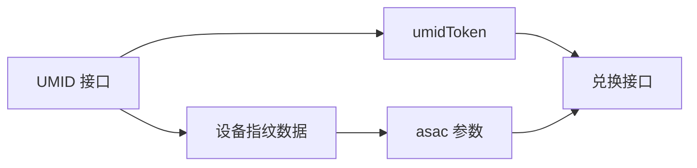

# UMID 设备指纹接口分析

阿里巴巴统一设备识别（UMID）服务接口完整分析

## 📋 接口概述

| 项目 | 内容 |
|------|------|
| **接口名称** | UMID 设备指纹服务 |
| **接口地址** | `https://ynuf.aliapp.org/service/um.json` |
| **请求方式** | POST |
| **Content-Type** | `application/x-www-form-urlencoded; charset=UTF-8` |
| **作用** | 设备指纹采集、风控校验、生成 umidToken |

---

## 🔍 真实抓包数据

### 完整的 CURL 命令

```bash
curl "https://ynuf.aliapp.org/service/um.json" \
  -H "accept: */*" \
  -H "accept-language: zh-CN,zh;q=0.9" \
  -H "content-type: application/x-www-form-urlencoded; charset=UTF-8" \
  -b "umdata_=T2gA0lXRgj5hg2ZNj1NYbSw7vC_HGx82zvHyyJfzjRbYQ56YziDJCTzuIqo7UCKGISY=; cbc=T2gAVEtfdQuGYno0VRQM8oweOGhC5Q2iY0NQ7wsjLIGEWYZGAWwI0tRHxoa8FJfpCD0=" \
  -H "origin: https://pages.tmall.com" \
  -H "referer: https://pages.tmall.com/" \
  -H "user-agent: Mozilla/5.0 (Windows NT 10.0; Win64; x64) AppleWebKit/537.36 (KHTML, like Gecko) Chrome/142.0.0.0 Safari/537.36 Edg/142.0.0.0" \
  --data-raw "data=107!fupXjx2jfQ6f5s22WPJKTF8G9UNP3LtfKeqtJ%2F%2FYGnlUFys1Gn5SZwLUV3698JOQVSYJdY1s43cj51s1fRJpIXPgC2TzrIwLffxRGf9JYs%2FlQ0PdNQsmX%2FyYzJgvz7BPsw%2BlkbIA7aNAQ%2FD%2F6Sufffqu2CI8WYgffDEkt3Kd5K5%2BYwjPfteXmuGutzAY8D%2FfdI4qWPGQfPfFdPY%2FtKeffX0%2FWSLqfMzPjG5sq8El%2BpbrwVmwciEQuY1803sAlajg%2BtW2Aoxeu9KEEK2GCaScju1RCE3SorMa1xt5o4QMJSpakqcuWrxc5v6Lhm9qHO3PCc79vVmGwyvEshbVXVKhWghLReEreM4cUVeS2iHCVcTKBxJl5M1bggAgp5k8nQcETJ58%2FPkWNf9z7nigzFsDFYl%2BaHHvGfe0pA6PlDc%2B9Ikvlx9GwijH32%2B2V1CDTXFS512lTdDRVjS9t%2F7iNP4ine2xKhB9vQKlIiRw3CMfPUPBSmK5sCm0d46tJ9cHIDigBw%2FsBkWYhQ8Wc7nzsbVLmLktv0f%2BaiGxGml6OqiAA4B%2FHPyf3q5f91I7%2B04P42vNpCkMjo4PC4dL9%2F5GmIhJfy3Q60oyGLKJ7fNWAp3suIn4cuh3GCQHnc8iR%2B9iGSeQotXW1Yy4KVefiXZz9h6T%2B7LzR2X3VX%2BPpR33OBE%2BlqADsf5rOIynW3xzCqDisZVUWT4Drb%2BkeAP2E%2Bx6YM%2FSlGJjYuJ7R5GsWfTfvB%2B7%2Fl1AJWXUr%2F%3D%3D&xa=ctl&xt="
```

---

## 🔑 关键参数解析

### 1. **data** 参数

**格式：** URL 编码的加密数据包

**示例（解码后的前缀）：**
```
107!fupXjx2jfQ6f5s22WPJKTF8G9UNP3LtfKeqtJ//YGnlUFys1Gn5SZwL...
```

**分析：**
- `107!` - 可能是数据版本号或类型标识
- 后续内容 - Base64 编码的设备行为数据

**包含的信息（推测）：**
- 🖥️ 屏幕分辨率
- 🖱️ 鼠标轨迹
- ⌨️ 键盘行为
- 🌐 浏览器指纹
- ⏱️ 时间戳
- 📱 设备信息

### 2. **Cookie 参数**

#### umdata_
```
T2gA0lXRgj5hg2ZNj1NYbSw7vC_HGx82zvHyyJfzjRbYQ56YziDJCTzuIqo7UCKGISY=
```
- **作用**: 设备唯一标识基础数据
- **长度**: ~64 字符
- **格式**: Base64 编码

#### cbc
```
T2gAVEtfdQuGYno0VRQM8oweOGhC5Q2iY0NQ7wsjLIGEWYZGAWwI0tRHxoa8FJfpCD0=
```
- **作用**: 加密校验码（Cipher Block Chaining）
- **长度**: ~64 字符
- **格式**: Base64 编码

### 3. **xa 参数**

```
xa=ctl
```
- **可能含义**: Control（控制类型）
- **作用**: 指示请求的操作类型

### 4. **xt 参数**

```
xt=
```
- **状态**: 此次抓包中为空
- **可能含义**: eXtended Token 或时间戳
- **作用**: 扩展字段，可能在某些场景下使用

---

## 🎯 接口作用

### 1. **设备指纹生成**

**流程：**
```
浏览器采集设备信息 
  → 生成 data 参数
  → 发送到 UMID 服务
  → 返回 umidToken
```

### 2. **风控校验**

**作用：**
- ✅ 验证设备真实性
- ✅ 检测异常行为
- ✅ 生成风控凭证

### 3. **与其他参数的关系**



---

## 📊 响应数据（推测）

### 成功响应

```json
{
  "code": "SUCCESS",
  "data": {
    "umidToken": "T2gA3oS44xIrqBycOdR...",
    "deviceId": "...",
    "sessionId": "..."
  }
}
```

### 失败响应

```json
{
  "code": "FAIL",
  "message": "设备校验失败"
}
```

**⚠️ 注意：** 以上响应结构为推测，需要通过真实抓包验证！

---

## 🔗 与兑换接口的关系

### 调用顺序

```
1. 页面加载
   ↓
2. 调用 UMID 接口（采集设备信息）
   ↓
3. 获得 umidToken
   ↓
4. 调用兑换接口（携带 umidToken）
   ↓
5. 兑换成功/失败
```

### 参数传递

| UMID 接口 | 兑换接口 | 关系 |
|-----------|----------|------|
| 响应中的 `umidToken` | 请求参数 `umidToken` | 直接使用 |
| Cookie `umdata_` | 生成 `ua` 参数 | 间接关系 |
| `data` 包中的信息 | `asac` 参数 | 可能相关 |

---

## 💡 如何获取 umidToken

### 方法1: 浏览器抓包（推荐）

**步骤：**

1. 打开浏览器开发者工具 (F12)
2. 切换到 Network 标签
3. 访问天猫礼享金页面
4. 筛选 XHR 请求
5. 查找 `um.json` 请求
6. 查看响应中的 umidToken

**位置：**
```
Response Body → data → umidToken
```

### 方法2: 从页面 JavaScript 提取

**在浏览器控制台运行：**

```javascript
// 方法 A: 从全局变量获取
console.log(window._um_data || window.umidToken);

// 方法 B: 监听网络请求
const observer = new PerformanceObserver((list) => {
  list.getEntries().forEach((entry) => {
    if (entry.name.includes('um.json')) {
      console.log('找到 UMID 请求:', entry);
    }
  });
});
observer.observe({ entryTypes: ['resource'] });
```

### 方法3: 从 Cookie 提取（备选）

**查看 Cookie：**
```javascript
// 在浏览器控制台运行
document.cookie.split(';').forEach(c => {
  if (c.includes('umidToken') || c.includes('umdata')) {
    console.log(c.trim());
  }
});
```

---

## ⚠️ 重要注意事项

### 1. **时效性**

- ⏱️ umidToken 可能有时效限制
- 🔄 建议定期刷新
- ⚠️ 过期后需要重新获取

### 2. **设备绑定**

- 🖥️ umidToken 与设备绑定
- 🚫 不能跨设备使用
- ⚠️ 更换设备需要重新生成

### 3. **风控限制**

- 🛡️ 频繁请求可能触发风控
- ⏸️ 建议适当间隔
- 📊 监控请求频率

### 4. **数据加密**

- 🔐 `data` 参数经过加密
- 🚫 无法手动构造
- ✅ 只能通过真实浏览器生成

---

## 🔧 我们系统的实现

### 当前状态

✅ **已支持 umidToken 参数**
```typescript
// /lib/tsdk.ts:277
umidToken: riskParams.umid_token
```

✅ **已验证 umidToken 必填**
```typescript
// /lib/usePurchase.ts:120
if (!riskParams.umid_token || 
    riskParams.umid_token === 'placeholder_umidToken_extract_from_browser') {
  throw new Error('请提取真实的 umidToken 参数');
}
```

✅ **已存储到 Supabase**
```typescript
// /lib/supabase.ts:240
umid_token: umidToken
```

### 不支持的功能

❌ **自动调用 UMID 接口**
- 原因：需要浏览器环境
- 影响：必须手动提取

❌ **自动刷新 umidToken**
- 原因：需要浏览器环境
- 影响：过期后需要手动更新

❌ **umidToken 校验**
- 原因：无法验证有效性
- 影响：只能在兑换时发现问题

---

## 📝 使用建议

### 获取频率

| 场景 | 建议 |
|------|------|
| 初次使用 | 必须获取 |
| 每日使用 | 建议刷新 |
| 兑换失败 | 检查是否过期 |
| 更换设备 | 必须重新获取 |

### 存储方式

```typescript
// 推荐：存储在 Supabase（我们已实现）
await riskParamsService.save(ua, umidToken, asac);

// 备选：本地存储（适合单设备）
localStorage.setItem('umidToken', umidToken);
```

### 验证方法

```typescript
// 1. 检查格式
if (!umidToken || umidToken.length < 50) {
  console.error('umidToken 格式错误');
}

// 2. 检查是否是占位符
if (umidToken.includes('placeholder')) {
  console.error('请提取真实的 umidToken');
}

// 3. 尝试兑换测��
// 如果返回风控错误，说明 umidToken 可能有问题
```

---

## 🔬 深入分析

### data 参数的可能结构

```javascript
{
  version: "107",
  deviceInfo: {
    screen: { width: 1920, height: 1080 },
    userAgent: "...",
    language: "zh-CN",
    timezone: 8,
    platform: "Win32"
  },
  behaviorData: {
    mouseTrack: [...],  // 鼠标轨迹
    clickPattern: [...], // 点击模式
    scrollDepth: [...],  // 滚动深度
    timing: {...}        // 时间信息
  },
  securityData: {
    canvas: "...",       // Canvas 指纹
    webgl: "...",        // WebGL 指纹
    fonts: [...]         // 字体列表
  }
}
```

**然后：**
```
JSON → 序列化 → Base64 编码 → 加密 → URL 编码 → data 参数
```

### umdata_ Cookie 的生成

```javascript
// 推测的生成逻辑
const deviceId = generateDeviceId();
const timestamp = Date.now();
const data = { deviceId, timestamp, ... };
const umdata_ = btoa(JSON.stringify(data));
```

---

## 🔗 相关文档

- [成功与失败对比分析](./SUCCESS_VS_FAILURE_COMPARISON.md) - 兑换接口响应分析
- [核心兑换接口](./CORE_EXCHANGE_API.md) - 兑换接口详细说明
- [风控参数提取指南](../风控参数提取完整指南.md) - 如何手动提取参数

---

## 📋 待验证问题

1. ❓ UMID 接口的响应结构是什么？
2. ❓ umidToken 的有效期是多久？
3. ❓ data 参数的具体加密算法是什么？
4. ❓ xa 和 xt 参数的完整含义？
5. ❓ umdata_ 和 cbc Cookie 的生成逻辑？

**需要通过更多真实抓包来验证！** 🔍

---

**最后更新：** 2025-11-13  
**基于真实抓包：** ✅  
**状态：** 持续完善中
