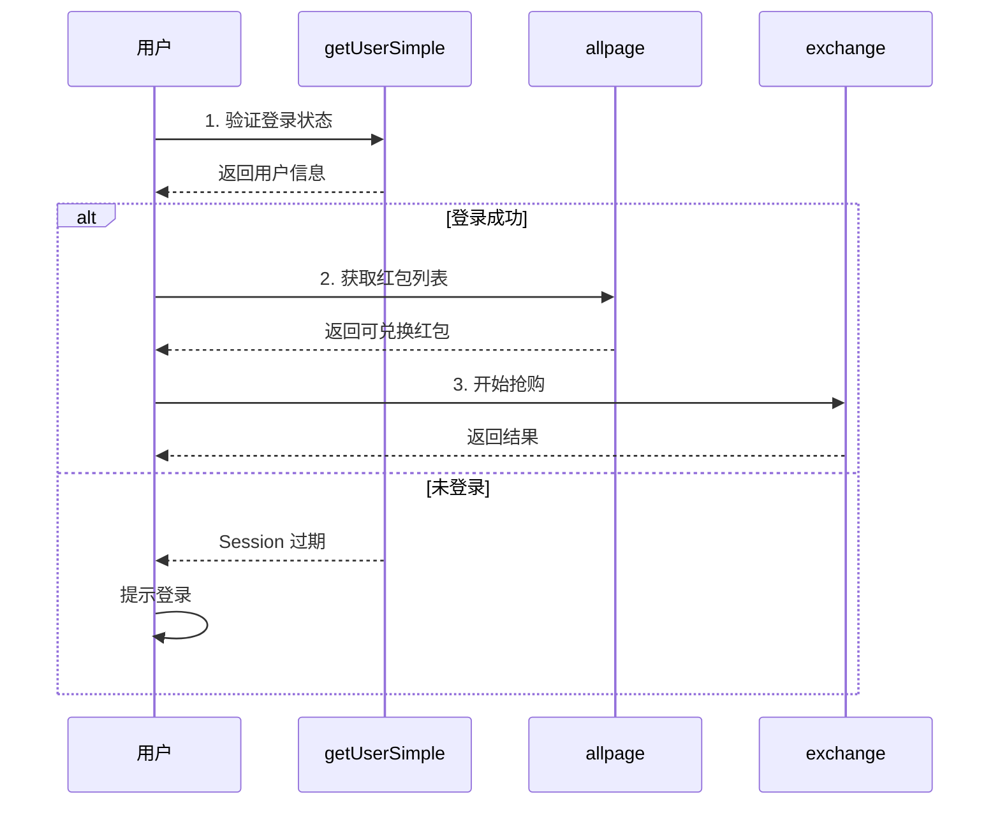

# 👤 用户信息接口文档

## 📡 接口概述

| 项目 | 内容 |
|------|------|
| **接口名称** | `mtop.user.getUserSimple` |
| **接口版本** | 1.0 |
| **请求方式** | GET (JSONP) |
| **域名** | h5api.m.tmall.com |
| **完整 URL** | https://h5api.m.tmall.com/h5/mtop.user.getUserSimple/1.0/ |
| **用途** | **获取用户基本信息，验证登录状态** ⭐ |
| **验证状态** | ✅ 已通过真实抓包验证 |

---

## 🎯 接口作用

### 主要用途

1. **验证登录状态** ⭐⭐⭐
   - 检查 Cookie 是否有效
   - 确认用户已登录
   - 前置验证步骤

2. **获取用户信息**
   - 用户昵称（nick）
   - 用户ID（userNumId）
   - 显示昵称（displayNick）

3. **抢购流程前置**
   - 在抢购前验证用户身份
   - 获取用户ID用于日志
   - 确保有效的登录态

---

## 📥 请求参数

### URL 参数

```
https://h5api.m.tmall.com/h5/mtop.user.getUserSimple/1.0/
?jsv=2.6.1
&appKey=12574478
&t=1763038858494
&sign=29938d907655dd357dc511ba2c0c6843
&api=mtop.user.getUserSimple
&v=1.0
&ecode=1
&sessionOption=AutoLoginOnly
&jsonpIncPrefix=liblogin
&type=jsonp
&dataType=jsonp
&callback=mtopjsonpliblogin3
&data={}
```

### 特殊参数

| 参数 | 值 | 说明 |
|------|-----|------|
| `sessionOption` | AutoLoginOnly | **自动登录模式** ⭐ |
| `ecode` | 1 | 错误码类型 |
| `jsonpIncPrefix` | liblogin | JSONP 前缀（登录相关）|
| `callback` | mtopjsonpliblogin3 | JSONP 回调函数 |
| `data` | {} | 空对象（无需参数）|

---

## 📤 响应结构

### 完整响应（JSONP）

```javascript
mtopjsonpliblogin3({
  "api": "mtop.user.getUserSimple",
  "v": "1.0",
  "ret": ["SUCCESS::调用成功"],
  "data": {
    "nick": "maxtung614",
    "userNumId": "2214191126140",
    "displayNick": "maxtung614"
  }
})
```

### 成功响应（data 对象）

```json
{
  "nick": "maxtung614",
  "userNumId": "2214191126140",
  "displayNick": "maxtung614"
}
```

---

## 📊 字段说明

| 字段 | 类型 | 示例 | 说明 |
|------|------|------|------|
| `nick` | string | "maxtung614" | 用户昵称 |
| `userNumId` | string | "2214191126140" | **用户唯一ID** ⭐ |
| `displayNick` | string | "maxtung614" | 显示昵称（通常与 nick 相同）|

---

## ✅ 响应状态

### 成功响应

```json
{
  "ret": ["SUCCESS::调用成功"],
  "data": {
    "nick": "...",
    "userNumId": "...",
    "displayNick": "..."
  }
}
```

**判断标准：**
- ✅ `ret[0]` 以 "SUCCESS" 开头
- ✅ `data` 对象包含用户信息

---

### 失败响应（未登录）

```json
{
  "ret": ["FAIL_SYS_SESSION_EXPIRED::Session过期"],
  "data": {}
}
```

**可能的错误：**
- `FAIL_SYS_SESSION_EXPIRED` - Session 过期
- `FAIL_SYS_USER_VALIDATE` - 用户验证失败
- `FAIL_SYS_TOKEN_EMPTY` - Token 为空

---

## 🎯 使用场景

### 场景1：验证登录状态

```typescript
async function checkLoginStatus() {
  try {
    const userInfo = await api.getUserInfo();
    
    if (userInfo.ret[0].startsWith('SUCCESS')) {
      console.log('✅ 登录状态有效');
      console.log(`用户: ${userInfo.data.nick}`);
      return true;
    } else {
      console.log('❌ 未登录');
      return false;
    }
  } catch (error) {
    console.error('❌ 验证失败:', error);
    return false;
  }
}
```

---

### 场景2：抢购前验证

```typescript
async function startPurchase() {
  // 1. 验证登录
  const userInfo = await api.getUserInfo();
  if (!userInfo.data.userNumId) {
    throw new Error('请先登录');
  }
  
  console.log(`当前用户: ${userInfo.data.nick} (${userInfo.data.userNumId})`);
  
  // 2. 获取红包列表
  const available = await api.getAvailableRedPacketsSorted();
  
  // 3. 开始抢购
  // ...
}
```

---

### 场景3：展示用户信息

```typescript
async function displayUserInfo() {
  const userInfo = await api.getUserInfo();
  
  return {
    nickname: userInfo.data.displayNick,
    userId: userInfo.data.userNumId,
    isLoggedIn: true
  };
}
```

---

## 🔐 安全说明

### sessionOption 参数

| 值 | 说明 |
|----|------|
| `AutoLoginOnly` | 仅自动登录模式（不主动跳转登录）|
| `AutoLoginAndManualLogin` | 自动登录 + 手动登录 |

**当前使用：** `AutoLoginOnly`

**含义：**
- ✅ 如果有有效 Cookie，自动验证
- ✅ 如果 Cookie 无效，返回失败（不跳转登录）
- ✅ 适合前端主动判断登录状态

---

## 🎯 集成到抢购流程

### 完整流程



---

### 代码实现

```typescript
class PurchaseSystem {
  async start() {
    // 步骤1: 验证登录
    const userInfo = await this.verifyLogin();
    
    // 步骤2: 获取红包列表
    const available = await this.getAvailableRedPackets();
    
    // 步骤3: 开始抢购
    await this.purchaseRedPackets(available);
  }
  
  async verifyLogin() {
    const info = await api.getUserInfo();
    
    if (!info.data.userNumId) {
      throw new Error('未登录，请先登录');
    }
    
    console.log(`✅ 登录成功: ${info.data.nick}`);
    return info;
  }
  
  async getAvailableRedPackets() {
    return await api.getAvailableRedPacketsSorted();
  }
  
  async purchaseRedPackets(redPackets) {
    for (const packet of redPackets) {
      try {
        await api.exchangeRedPacket(packet.benefitCode, riskParams);
        console.log(`✅ 成功兑换 ${packet.amount}元`);
        break;
      } catch (error) {
        console.log(`❌ 失败: ${error.message}`);
        continue;
      }
    }
  }
}
```

---

## 📊 接口对比

| 接口 | 用途 | data 参数 | 前置条件 |
|------|------|-----------|----------|
| **getUserSimple** | 验证登录 | {} | Cookie |
| **allpage** | 获取红包列表 | {} | 已登录 |
| **exchange** | 兑换红包 | {benefitCode, ua, ...} | 已登录 + 风控参数 |

**完整流程：**
```
getUserSimple（验证）→ allpage（列表）→ exchange（兑换）
```

---

## 💡 最佳实践

### 1. **定期验证**

```typescript
// 每30秒验证一次登录状态
setInterval(async () => {
  try {
    await api.getUserInfo();
    console.log('✅ 登录状态正常');
  } catch (error) {
    console.error('❌ 登录已失效，请重新登录');
    // 停止抢购任务
  }
}, 30000);
```

---

### 2. **错误处理**

```typescript
async function safeGetUserInfo() {
  try {
    const info = await api.getUserInfo();
    
    if (info.ret[0].includes('EXPIRED')) {
      return { isLoggedIn: false, reason: 'Session过期' };
    }
    
    return { isLoggedIn: true, userInfo: info.data };
    
  } catch (error) {
    return { isLoggedIn: false, reason: error.message };
  }
}
```

---

### 3. **日志记录**

```typescript
async function logUserActivity() {
  const info = await api.getUserInfo();
  
  console.log({
    timestamp: new Date().toISOString(),
    userId: info.data.userNumId,
    userName: info.data.nick,
    action: 'start_purchase'
  });
}
```

---

## 🔗 相关接口

| 接口 | 关系 |
|------|------|
| **getUserSimple** | 前置验证 → |
| **allpage** | ← 依赖登录 |
| **exchange** | ← 依赖登录 |

---

## ✅ TypeScript 类型定义

```typescript
interface UserInfo {
  nick: string;
  userNumId: string;
  displayNick: string;
}

interface UserInfoResponse {
  api: string;
  v: string;
  ret: string[];
  data: UserInfo;
}

class TSDK {
  /**
   * 获取用户信息
   */
  async getUserInfo(): Promise<UserInfoResponse> {
    return this.request(
      'mtop.user.getUserSimple',
      '1.0',
      {},
      {
        ecode: '1',
        sessionOption: 'AutoLoginOnly',
        jsonpIncPrefix: 'liblogin'
      }
    );
  }
  
  /**
   * 验证登录状态
   */
  async isLoggedIn(): Promise<boolean> {
    try {
      const info = await this.getUserInfo();
      return info.ret[0].startsWith('SUCCESS');
    } catch {
      return false;
    }
  }
}
```

---

## 🎊 总结

### ✅ 接口特点

1. **简单易用**：data 为空对象，无需参数
2. **快速验证**：快速检查登录状态
3. **信息丰富**：提供用户昵称和ID
4. **可靠性高**：作为所有接口的前置验证

### ✅ 在抢购系统中的价值

- 🔍 **登录验证**：确保用户已登录
- 📊 **用户识别**：获取用户ID用于日志
- 🚀 **流程控制**：决定是否继续抢购
- 🔐 **安全保障**：防止无效请求

### ✅ 使用建议

1. 每次抢购前先调用此接口
2. 定期验证登录状态（避免 Session 过期）
3. 记录用户ID用于日志分析
4. 登录失败时提示用户

---

**最后更新：** 2025-11-13  
**基于真实抓包：** ✅ (完整请求+响应)  
**验证状态：** ✅ 响应结构 100% 正确  
**实现状态：** ✅ 已集成到 TSDK
